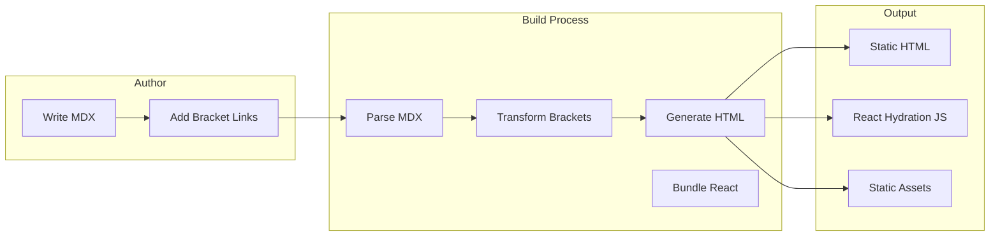
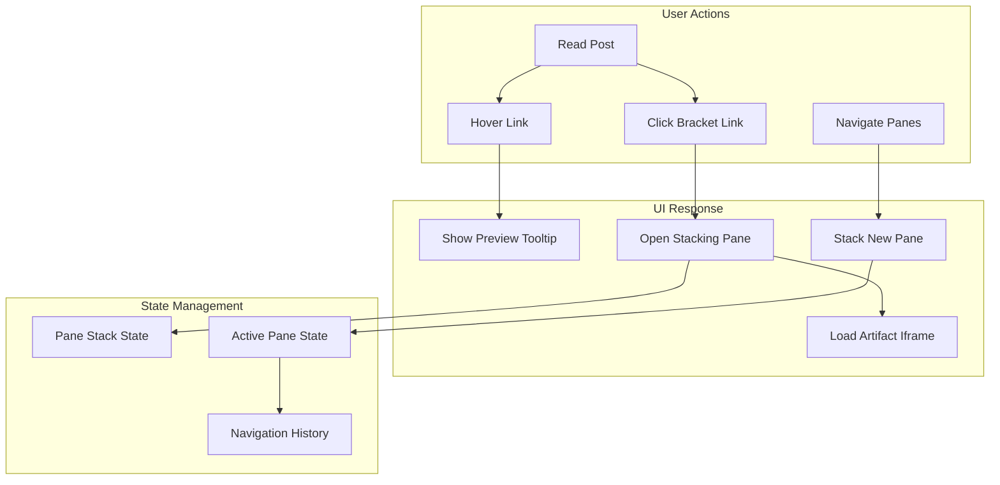
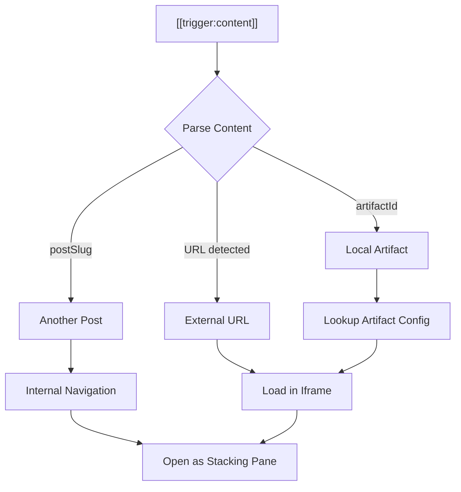
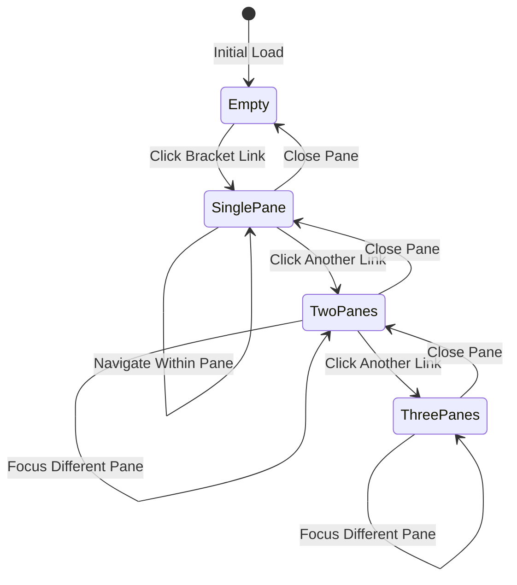
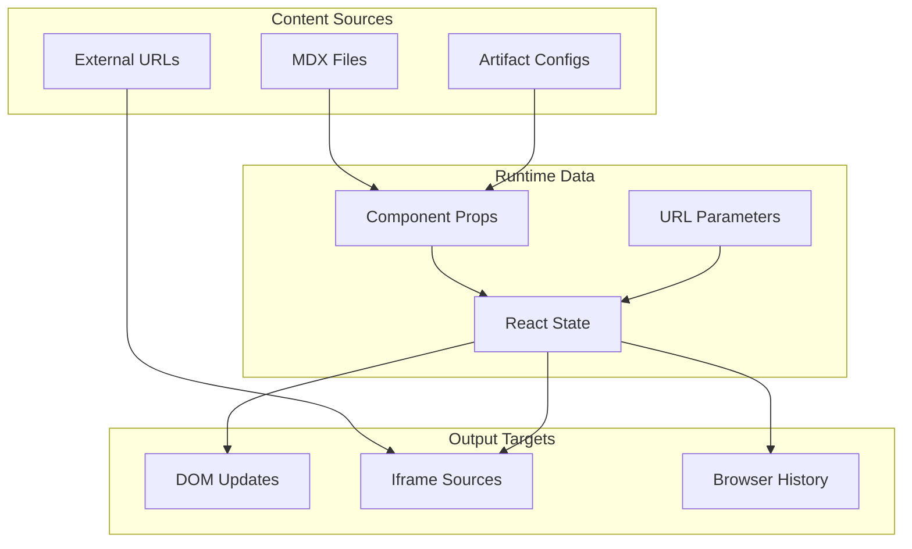

# Data Flow

## Content Flow (Build Time)

## User Interaction Flow (Runtime)

## Bracket Link Resolution

## Stacking Panes State

## Data Sources

## Artifact Types

| Type | Source | Rendering |
|------|--------|-----------|
| `url` | External URL | Iframe |
| `artifact` | Claude Artifact ID | Iframe to claude.site |
| `post` | Internal post slug | Stacking pane with post content |
| `component` | React component | Direct render in pane |
