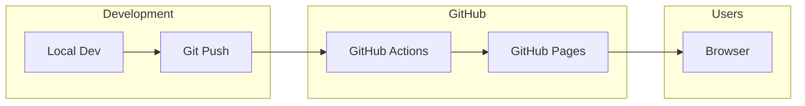
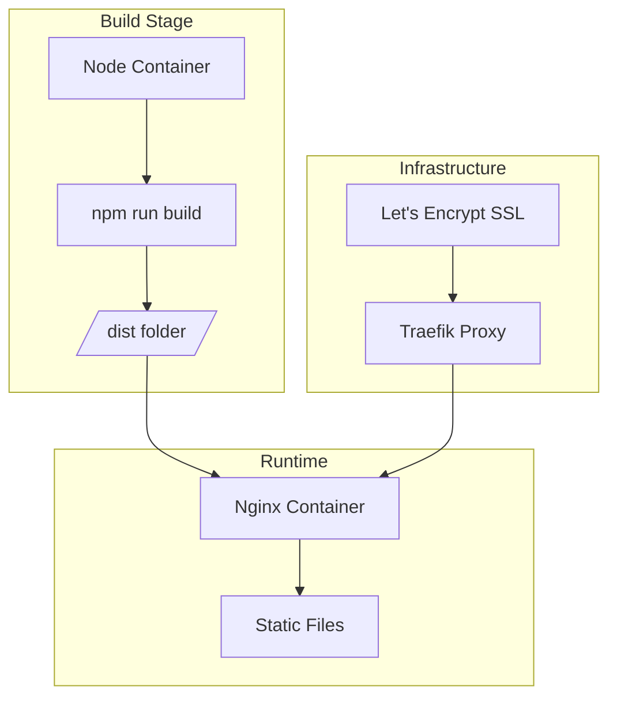
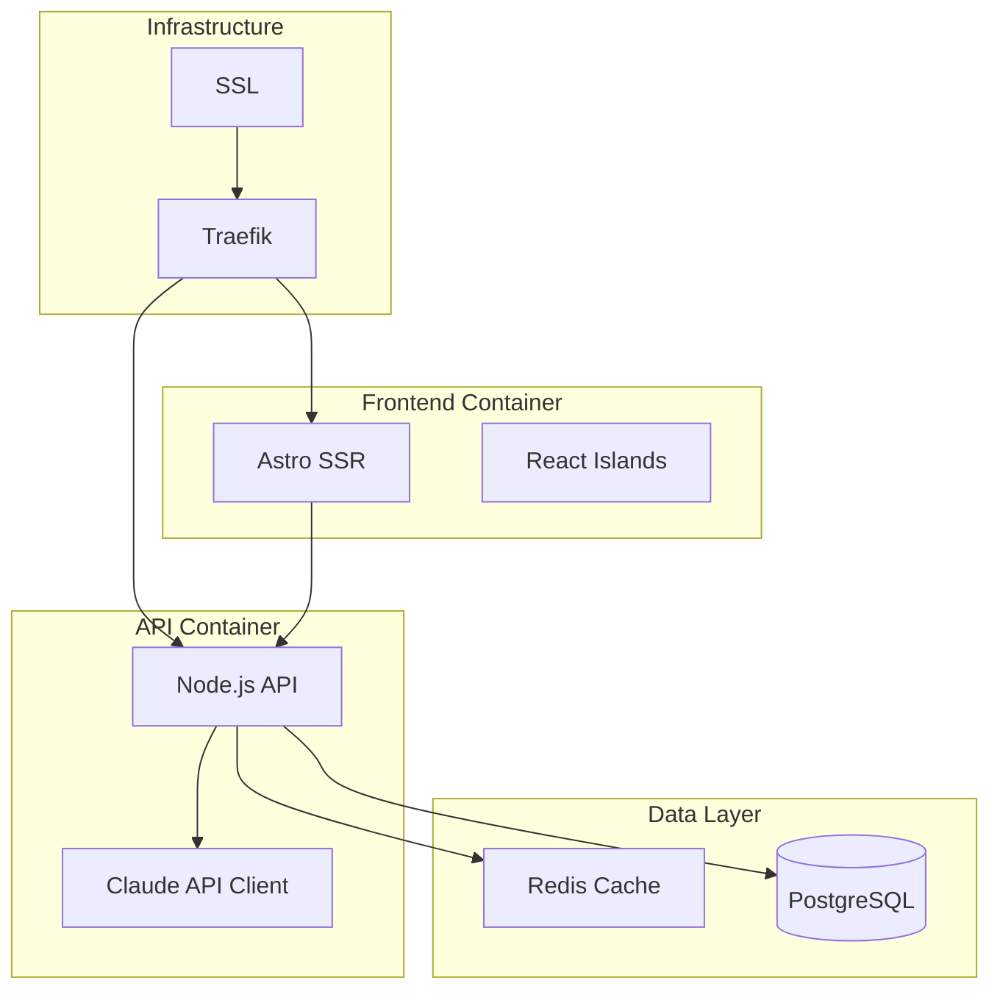
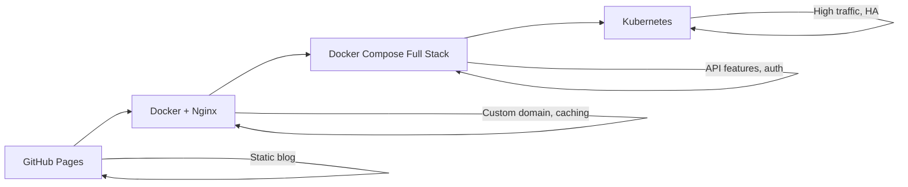

# Docker Deployment Architecture

## Future Deployment Options

This document outlines potential Docker-based deployment architectures for when the project grows beyond static hosting.

---

## Option 1: Static + CDN (Current)

Simple GitHub Pages deployment - no Docker needed.



**When to use:** Static content only, no backend services.

---

## Option 2: Docker + Nginx (Self-Hosted Static)

For self-hosting on a VPS with more control.



```dockerfile
# Dockerfile.static
FROM node:20-alpine AS builder
WORKDIR /app
COPY package*.json ./
RUN npm ci
COPY . .
RUN npm run build

FROM nginx:alpine
COPY --from=builder /app/dist /usr/share/nginx/html
COPY nginx.conf /etc/nginx/nginx.conf
EXPOSE 80
```

---

## Option 3: Full Stack (With API Backend)

For when you need server-side features (Claude API, auth, etc.)



### Docker Compose

```yaml
# docker-compose.yml
version: '3.8'

services:
  web:
    build:
      context: .
      dockerfile: Dockerfile
    ports:
      - "4321:4321"
    environment:
      - NODE_ENV=production
    depends_on:
      - api

  api:
    build:
      context: ./api
      dockerfile: Dockerfile
    environment:
      - CLAUDE_API_KEY=${CLAUDE_API_KEY}
      - DATABASE_URL=${DATABASE_URL}
      - REDIS_URL=redis://redis:6379
    depends_on:
      - db
      - redis

  db:
    image: postgres:15-alpine
    volumes:
      - postgres_data:/var/lib/postgresql/data
    environment:
      - POSTGRES_DB=mapthewild
      - POSTGRES_USER=${DB_USER}
      - POSTGRES_PASSWORD=${DB_PASSWORD}

  redis:
    image: redis:7-alpine
    volumes:
      - redis_data:/data

  traefik:
    image: traefik:v2.10
    ports:
      - "80:80"
      - "443:443"
    volumes:
      - /var/run/docker.sock:/var/run/docker.sock
      - ./traefik:/etc/traefik

volumes:
  postgres_data:
  redis_data:
```

---

## Option 4: Kubernetes (Scale)

For high availability and auto-scaling.

```mermaid
graph TB
    subgraph "Ingress"
        LB[Load Balancer]
        Ingress[K8s Ingress]
    end

    subgraph "Web Tier"
        Web1[Web Pod 1]
        Web2[Web Pod 2]
        Web3[Web Pod N]
    end

    subgraph "API Tier"
        API1[API Pod 1]
        API2[API Pod 2]
    end

    subgraph "Data Tier"
        PG[PostgreSQL StatefulSet]
        Redis[Redis Cluster]
    end

    subgraph "External"
        Claude[Claude API]
        S3[S3/R2 Storage]
    end

    LB --> Ingress
    Ingress --> Web1
    Ingress --> Web2
    Ingress --> Web3
    Web1 --> API1
    Web2 --> API2
    Web3 --> API1
    API1 --> PG
    API2 --> PG
    API1 --> Redis
    API2 --> Redis
    API1 --> Claude
    API1 --> S3
```

---

## Recommended Evolution Path



| Stage | When to Use | Complexity |
|-------|-------------|------------|
| GitHub Pages | MVP, static content | Low |
| Docker + Nginx | Custom domain, self-host | Medium |
| Docker Compose | Backend features needed | Medium-High |
| Kubernetes | Scale, high availability | High |

---

## Environment Variables (Future)

```env
# .env.production
NODE_ENV=production
SITE_URL=https://mapthewild.com

# API (when needed)
CLAUDE_API_KEY=sk-...
DATABASE_URL=postgresql://...
REDIS_URL=redis://...

# Auth (when needed)
AUTH_SECRET=...
GITHUB_CLIENT_ID=...
GITHUB_CLIENT_SECRET=...
```
