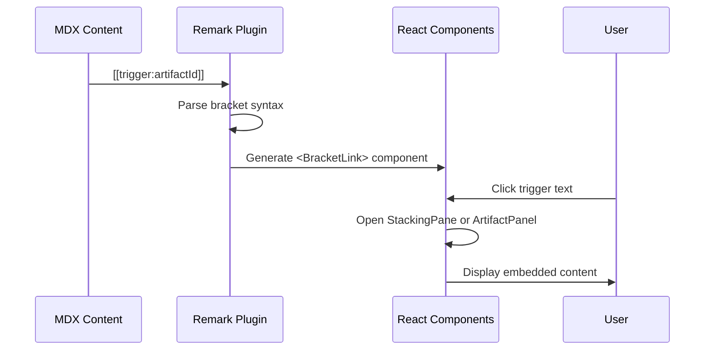

# System Architecture

## Overview

Map the Wild is an Astro-based blog with interactive React components for embedding live artifacts and stacking pane navigation.

## High-Level Architecture

```mermaid
graph TB
    subgraph "Content Layer"
        MDX[MDX Posts]
        Brackets[Bracket Syntax<br/>[[trigger:content]]]
    end

    subgraph "Build Layer (Astro)"
        Remark[Remark Plugin<br/>bracketParser.ts]
        Astro[Astro Static Build]
        Collections[Content Collections]
    end

    subgraph "Runtime Layer (React)"
        SP[StackingPanes.tsx]
        AP[ArtifactPanel.tsx]
        Iframes[Embedded Iframes]
    end

    subgraph "Hosting"
        GHP[GitHub Pages]
        CDN[GitHub CDN]
    end

    MDX --> Brackets
    Brackets --> Remark
    Remark --> Astro
    Collections --> Astro
    Astro --> GHP
    GHP --> CDN

    SP --> Iframes
    AP --> Iframes
```

## Component Architecture

```mermaid
graph LR
    subgraph "Layout"
        Layout[BaseLayout.astro]
        PostLayout[PostLayout.astro]
    end

    subgraph "Interactive Components"
        SP[StackingPanes]
        AP[ArtifactPanel]
        HP[HoverPreview]
    end

    subgraph "Content Processing"
        BP[bracketParser.ts]
        CT[Content Types]
    end

    Layout --> PostLayout
    PostLayout --> SP
    SP --> AP
    SP --> HP
    BP --> SP
```

## Bracket Syntax Processing



## File Structure

```
mapthewild/
├── src/
│   ├── content/
│   │   └── posts/           # MDX blog posts
│   ├── components/
│   │   ├── StackingPanes.tsx
│   │   ├── ArtifactPanel.tsx
│   │   └── HoverPreview.tsx
│   ├── layouts/
│   │   ├── BaseLayout.astro
│   │   └── PostLayout.astro
│   └── lib/
│       └── bracketParser.ts  # Remark plugin
├── public/
│   └── assets/
├── astro.config.mjs
└── package.json
```

## Technology Stack

| Layer | Technology |
|-------|------------|
| Framework | Astro 4.x |
| Content | MDX |
| Interactive | React 18 |
| Styling | Tailwind CSS |
| Animation | Framer Motion |
| Hosting | GitHub Pages |
| CI/CD | GitHub Actions |
